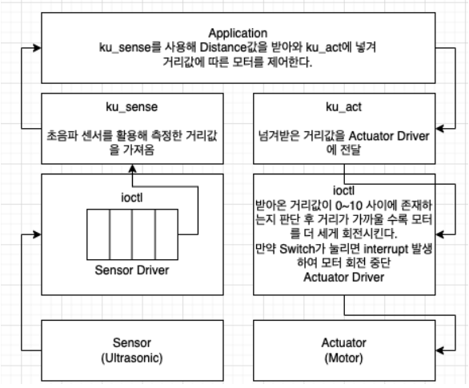

# 🚘 프로젝트 소개
## 라즈베리파이를 Character Device로 사용한 후방 충돌 회피

# 🛠️ 사용 센서
- 초음파 센서
- 스위치
 

# 📄 시나리오
초음파에서 측정 거리가 0~10 사이로 측정되었을 때, 모터는 거리가 가까울 수록 더 빠르게 회전합니다. 이는 자동차에서 후방에 어떠한 물체가 빠르게 다가옴을 감지할 때 앞으로 전진하여 충돌을 회피하 는 기능을 보고 착안하여 설계. 
만약 이러한 모터 동작을 멈추고 싶다면 스위치를 눌러 모터 작동을 정지시킬 수 있음.
 

# 🚀  데이터 흐름

</img>

- 초음파 센서에서 거리 데이터를 받는다. 
- 그 후 거리 값 을 계산하여 kernel에 존재하는 linked list 앞에 저장되고 따라서 가장 최근 데이터가 맨 앞에 존재하게 된다. 
- App에서는 이렇게 저장된 거리 데이터 값을 읽어와 act_module에 값을 넘기고 해당 driver에서는 거리값이 0~10 사이에 존재하는 경우 모터를 회전시키기 시작한다. 만약 중간에 모터 동작을 멈추고 싶다면 스위치를 눌러 interrupt handler를 작동시켜 중지가 가능하다.
- 센서 드라이버에서는 매 2초마다 반복적으로 초음파 센서를 작동시켜 값을 받아오며 이는 Interrupt 방식으로 실행된다. 반대로 actuator에서는 App에서 명령을 내리기 전까지 스스로 동작하지 않습니다.

